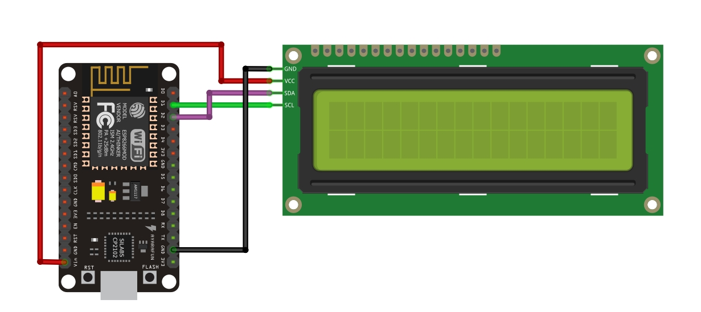

## Comunicação local via socket
#### Esse é um teste de comunicação local via socket entre um ESP8266 e um programa em Python

&nbsp;
### Configurando o servidor no ESP8266:

Para instalar o arquivo na placa de desenvolvimento ESP8266 é necessário ter o [ESP8266_Arduino Core](https://github.com/esp8266/Arduino) em sua IDE.

Certifique-se ao instalar o código em sua placa de alterar o SSID e Password para os valores de sua rede.
```C++
#define SSID "*****"
#define PASSWD "*****"
```
Material para montagem do circuito:
- Placa de desenvolvimento NodeMCU ESP8266;
- Display 16x02 com adaptador de comunicação I2C.

Esquema de montagem:


---
### Configurando o client em Python no computador:

Existem dois programas Python nesse projeto. Um deles sabendo o IP o outro não sabendo o IP de seu servidor.

Para utilizar o com IP conhecido altere a constante para o IP que será exibido no display do seu servidor ESP8266 antes de executar:
```Python
SERVER_IP = "192.168.1.20"
```

O programa com IP desconhecido executara um comando arp -a em sua rede e verificar todos IPs conectados. Ao encontrar um deles com a porta 24000 aberta fechará conexão.

Se tudo funcionar você poderá enviar mensagens do seu computador para o ESP8266. A mensagem aparecerá no display.

Adicionei dois comandos na programação. O comando "led on" irá acender um led na placa de desenvolvimento presente na porta 16. Para apagá-lo envie o comando "led off".

Divirta-se com o código, altere e me mostre o que fez de legal.